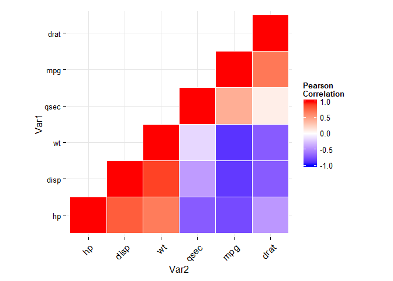
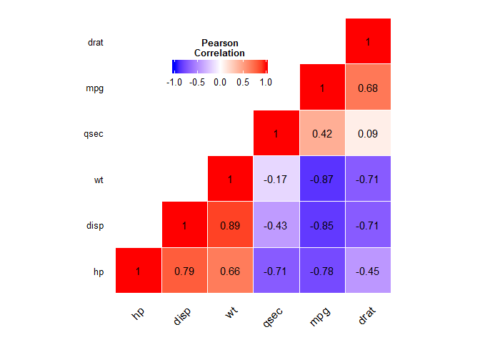

# heatmap_template
Jingzhe Jiang  
2015年10月22日  


```r
library(reshape2)
library(ggplot2)
mydata <- mtcars[, c(1,3,4,5,6,7)]
head(mydata)
```

```
##                    mpg disp  hp drat    wt  qsec
## Mazda RX4         21.0  160 110 3.90 2.620 16.46
## Mazda RX4 Wag     21.0  160 110 3.90 2.875 17.02
## Datsun 710        22.8  108  93 3.85 2.320 18.61
## Hornet 4 Drive    21.4  258 110 3.08 3.215 19.44
## Hornet Sportabout 18.7  360 175 3.15 3.440 17.02
## Valiant           18.1  225 105 2.76 3.460 20.22
```

```r
# Correlation matrix can be created using the R function cor() :
cormat <- round(cor(mydata),2) # round() specified number of decimal places
head(cormat)
```

```
##        mpg  disp    hp  drat    wt  qsec
## mpg   1.00 -0.85 -0.78  0.68 -0.87  0.42
## disp -0.85  1.00  0.79 -0.71  0.89 -0.43
## hp   -0.78  0.79  1.00 -0.45  0.66 -0.71
## drat  0.68 -0.71 -0.45  1.00 -0.71  0.09
## wt   -0.87  0.89  0.66 -0.71  1.00 -0.17
## qsec  0.42 -0.43 -0.71  0.09 -0.17  1.00
```

```r
# Get upper triangle of the correlation matrix
get_upper_tri <- function(cormat){
  cormat[lower.tri(cormat)]<- NA
  return(cormat)
}
upper_tri <- get_upper_tri(cormat)
upper_tri
```

```
##      mpg  disp    hp  drat    wt  qsec
## mpg    1 -0.85 -0.78  0.68 -0.87  0.42
## disp  NA  1.00  0.79 -0.71  0.89 -0.43
## hp    NA    NA  1.00 -0.45  0.66 -0.71
## drat  NA    NA    NA  1.00 -0.71  0.09
## wt    NA    NA    NA    NA  1.00 -0.17
## qsec  NA    NA    NA    NA    NA  1.00
```

```r
# Reorder the correlation matrix
reorder_cormat <- function(cormat){
# Use correlation between variables as distance
dd <- as.dist((1-cormat)/2)
hc <- hclust(dd)
cormat <-cormat[hc$order, hc$order]
}
# Reorder the correlation matrix
cormat <- reorder_cormat(cormat)
upper_tri <- get_upper_tri(cormat)
# Melt the correlation matrix
melted_cormat <- melt(upper_tri)
melted_cormat <- na.omit(melted_cormat)

# Create a ggheatmap
ggheatmap <- ggplot(melted_cormat, aes(Var2, Var1, fill = value))+
 geom_tile(color = "white")+
 scale_fill_gradient2(low = "blue", high = "red", mid = "white", 
   midpoint = 0, limit = c(-1,1), name="Pearson\nCorrelation") +
  theme_minimal()+ # minimal theme
 theme(axis.text.x = element_text(angle = 45, vjust = 1, 
    size = 12, hjust = 1))+
 coord_fixed()
```

```
## Warning: Non Lab interpolation is deprecated
```

```r
# Print the heatmap
print(ggheatmap)
```

 

```r
# Add correlation coefficients on the heatmap
ggheatmap + 
geom_text(aes(Var2, Var1, label = value), color = "black", size = 4) +
theme(
  axis.title.x = element_blank(),
  axis.title.y = element_blank(),
  panel.grid.major = element_blank(),
  panel.border = element_blank(),
  panel.background = element_blank(),
  axis.ticks = element_blank(),
  legend.justification = c(1, 0),
  legend.position = c(0.6, 0.7),
  legend.direction = "horizontal")+
  guides(fill = guide_colorbar(barwidth = 7, barheight = 1,
                title.position = "top", title.hjust = 0.5))
```

 


