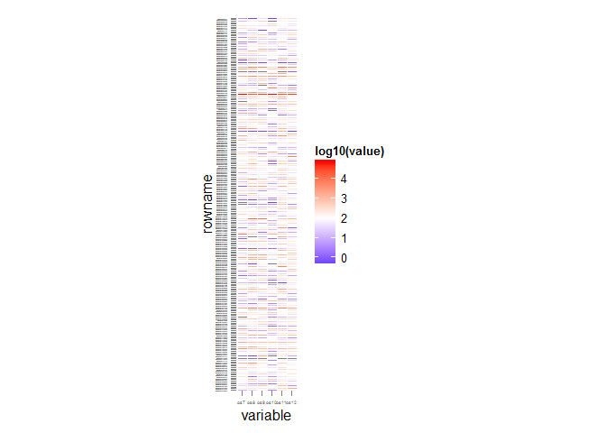
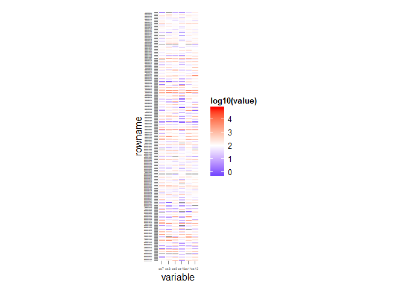
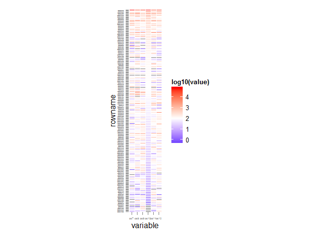
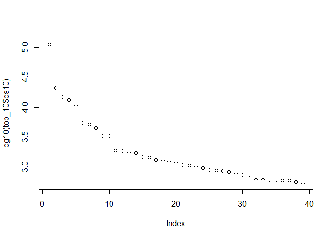
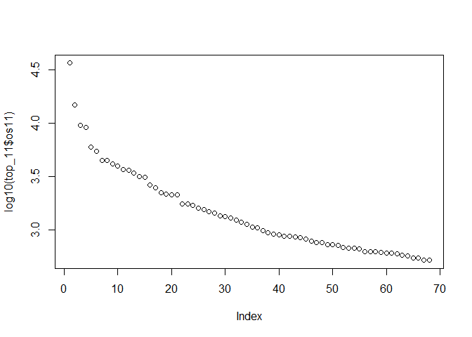
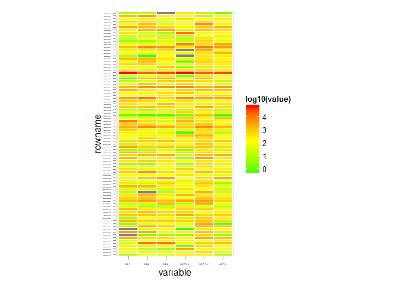
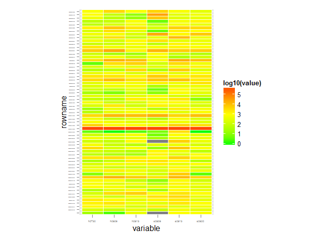
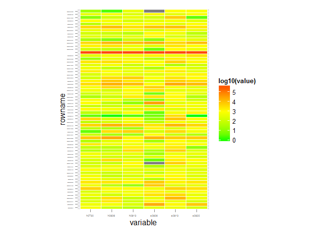
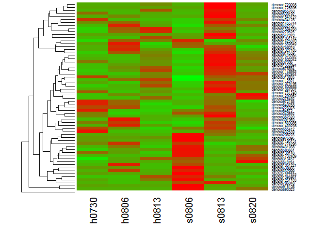
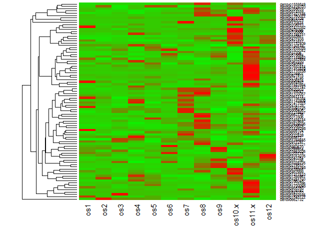

# top_100_heatmap_and_indicative_species_analyze
Jingzhe Jiang  
2015年10月19日  
# top 100 otus
combine top 100 otus of each oyster samples in cohort 2

## read data

```r
library(dplyr)
```

```
## 
## Attaching package: 'dplyr'
## 
## The following objects are masked from 'package:stats':
## 
##     filter, lag
## 
## The following objects are masked from 'package:base':
## 
##     intersect, setdiff, setequal, union
```

```r
origin_data <- read.csv("D:/bioinfo/UBC_data/otu_summaries/otu_table_os_top960_NormAndRanked.csv", header = TRUE, row.names = 1) # single number giving the column of the table which contains the row names. But dpyr never preserve row names, you should use add_rownames() to preserve them!
str(origin_data)
```

```
## 'data.frame':	960 obs. of  12 variables:
##  $ os1 : int  65781 6220 3572 1863 239 632 2239 2038 3537 9216 ...
##  $ os2 : int  166746 12708 762 174 456 899 1571 962 1218 669 ...
##  $ os3 : int  133838 3240 1622 799 1095 2425 1246 4931 1098 216 ...
##  $ os4 : int  114072 7716 138 1465 832 321 2280 243 7172 110 ...
##  $ os5 : int  116996 25435 1546 80 271 2153 1378 1093 286 2709 ...
##  $ os6 : int  53608 20694 2523 410 1598 3401 1585 5390 2444 705 ...
##  $ os7 : int  103203 2675 2239 83 4953 3386 2691 1232 4012 129 ...
##  $ os8 : int  32723 9560 11451 19998 15650 11040 7173 2677 2223 2059 ...
##  $ os9 : int  56342 7871 7209 17405 1020 4394 2064 3516 1243 65 ...
##  $ os10: int  112139 13210 770 155 10638 1705 5373 34 101 245 ...
##  $ os11: int  36434 3173 14906 1187 4509 9532 6013 2188 1448 9157 ...
##  $ os12: int  64483 7371 7489 2369 4602 2998 1427 3894 2628 352 ...
```

```r
row.names(origin_data) %>% head
```

```
## [1] "denovo662732"  "denovo1425070" "denovo814559"  "denovo1760022"
## [5] "denovo1559849" "denovo1327185"
```

```r
colnames(origin_data)
```

```
##  [1] "os1"  "os2"  "os3"  "os4"  "os5"  "os6"  "os7"  "os8"  "os9"  "os10"
## [11] "os11" "os12"
```

```r
mydata <- origin_data %>% add_rownames %>% tbl_df
mydata %>% glimpse
```

```
## Observations: 960
## Variables: 13
## $ rowname (chr) "denovo662732", "denovo1425070", "denovo814559", "deno...
## $ os1     (int) 65781, 6220, 3572, 1863, 239, 632, 2239, 2038, 3537, 9...
## $ os2     (int) 166746, 12708, 762, 174, 456, 899, 1571, 962, 1218, 66...
## $ os3     (int) 133838, 3240, 1622, 799, 1095, 2425, 1246, 4931, 1098,...
## $ os4     (int) 114072, 7716, 138, 1465, 832, 321, 2280, 243, 7172, 11...
## $ os5     (int) 116996, 25435, 1546, 80, 271, 2153, 1378, 1093, 286, 2...
## $ os6     (int) 53608, 20694, 2523, 410, 1598, 3401, 1585, 5390, 2444,...
## $ os7     (int) 103203, 2675, 2239, 83, 4953, 3386, 2691, 1232, 4012, ...
## $ os8     (int) 32723, 9560, 11451, 19998, 15650, 11040, 7173, 2677, 2...
## $ os9     (int) 56342, 7871, 7209, 17405, 1020, 4394, 2064, 3516, 1243...
## $ os10    (int) 112139, 13210, 770, 155, 10638, 1705, 5373, 34, 101, 2...
## $ os11    (int) 36434, 3173, 14906, 1187, 4509, 9532, 6013, 2188, 1448...
## $ os12    (int) 64483, 7371, 7489, 2369, 4602, 2998, 1427, 3894, 2628,...
```

```r
row.names(mydata) %>% head
```

```
## [1] "1" "2" "3" "4" "5" "6"
```
## select top 100 otus ids
from each samples (os7-os12), than combined and get rid of redundences, than filtrate from my data

```r
top_7 <- mydata %>% 
    arrange(desc(os7)) %>% 
      select(rowname) %>% 
        head(100)
top_8 <- mydata %>% 
    arrange(desc(os8)) %>% 
      select(rowname) %>% 
        head(100)
top_9 <- mydata %>% 
    arrange(desc(os9)) %>% 
      select(rowname) %>% 
        head(100)
top_10 <- mydata %>% 
    arrange(desc(os10)) %>% 
      select(rowname) %>% 
        head(100)
top_11 <- mydata %>% 
    arrange(desc(os11)) %>% 
      select(rowname) %>% 
        head(100)
top_12 <- mydata %>% 
    arrange(desc(os12)) %>% 
      select(rowname) %>% 
        head(100)
# all = TRUE means full Outer join tables
top_cohort2 <- merge(top_12,top_11, by = "rowname", all = TRUE)
top_cohort2 <- merge(top_cohort2,top_10, by = "rowname", all = TRUE)
top_cohort2 <- merge(top_cohort2,top_9, by = "rowname", all = TRUE)
top_cohort2 <- merge(top_cohort2,top_8, by = "rowname", all = TRUE)
top_cohort2 <- merge(top_cohort2,top_7, by = "rowname", all = TRUE)
top_cohort2_data <- merge(mydata, top_cohort2, by = "rowname", all.y = TRUE)
top_cohort2_data %>% arrange(desc(os8)) %>% head
```

```
##         rowname   os1    os2    os3    os4    os5   os6    os7   os8   os9
## 1  denovo662732 65781 166746 133838 114072 116996 53608 103203 32723 56342
## 2 denovo1760022  1863    174    799   1465     80   410     83 19998 17405
## 3 denovo1559849   239    456   1095    832    271  1598   4953 15650  1020
## 4  denovo814559  3572    762   1622    138   1546  2523   2239 11451  7209
## 5 denovo1327185   632    899   2425    321   2153  3401   3386 11040  4394
## 6 denovo1425070  6220  12708   3240   7716  25435 20694   2675  9560  7871
##     os10  os11  os12
## 1 112139 36434 64483
## 2    155  1187  2369
## 3  10638  4509  4602
## 4    770 14906  7489
## 5   1705  9532  2998
## 6  13210  3173  7371
```
## normalized columns
based on the total reads of each sample

```r
# clip total reads from excel, than paste into R
refs <- read.delim("refs.txt", header = TRUE)
```

```
## Warning in read.table(file = file, header = header, sep = sep, quote =
## quote, : incomplete final line found by readTableHeader on 'refs.txt'
```

```r
refs %>% glimpse
```

```
## Observations: 1
## Variables: 13
## $ seqID (fctr) totReads
## $ os1   (int) 494604
## $ os2   (int) 311167
## $ os3   (int) 493566
## $ os4   (int) 470232
## $ os5   (int) 547637
## $ os6   (int) 490970
## $ os7   (int) 501020
## $ os8   (int) 507057
## $ os9   (int) 478260
## $ os10  (int) 545820
## $ os11  (int) 496962
## $ os12  (int) 554586
```

```r
## top_normal <- top_cohort2_data[,2:13]*311167/as.numeric(refs[1,2:13])
## 两个dataframe相除必须维度一致，或者将分母转变为vector才可以相除。但above is not correct, but I don't know why!
top_normal <- top_cohort2_data[,2:13]*311167/refs[rep(1,251),2:13]
#两个dataframe相除必须维度一致，因此用rep(1,251)复制了refs中的ttlReads数据，使其变成dataframe。参见如下：
refs[rep(1,5),1:13]
```

```
##        seqID    os1    os2    os3    os4    os5    os6    os7    os8
## 1   totReads 494604 311167 493566 470232 547637 490970 501020 507057
## 1.1 totReads 494604 311167 493566 470232 547637 490970 501020 507057
## 1.2 totReads 494604 311167 493566 470232 547637 490970 501020 507057
## 1.3 totReads 494604 311167 493566 470232 547637 490970 501020 507057
## 1.4 totReads 494604 311167 493566 470232 547637 490970 501020 507057
##        os9   os10   os11   os12
## 1   478260 545820 496962 554586
## 1.1 478260 545820 496962 554586
## 1.2 478260 545820 496962 554586
## 1.3 478260 545820 496962 554586
## 1.4 478260 545820 496962 554586
```

```r
rownames(top_normal) <- top_cohort2_data$rowname
top_normal %>% str
```

```
## 'data.frame':	251 obs. of  12 variables:
##  $ os1 : num  17 294.4 194.4 44.7 0 ...
##  $ os2 : num  0 524 2051 185 3 ...
##  $ os3 : num  43.5 88.3 158.9 100.9 93.9 ...
##  $ os4 : num  0.662 251.458 251.458 898.63 0.662 ...
##  $ os5 : num  11.9 218.2 1877.3 176.1 13.1 ...
##  $ os6 : num  1.9 209.78 252.88 6.97 38.03 ...
##  $ os7 : num  10.6 187.6 261.5 31.1 37.3 ...
##  $ os8 : num  28.84 200.06 276.15 22.71 5.52 ...
##  $ os9 : num  135.33 201.69 65.71 709.83 4.55 ...
##  $ os10: num  2.85 55.87 18.81 174.45 1.71 ...
##  $ os11: num  227 424 128 929 221 ...
##  $ os12: num  65.65 1691.09 135.22 3.93 67.89 ...
```

```r
top_cohort2_data %>% str
```

```
## 'data.frame':	251 obs. of  13 variables:
##  $ rowname: chr  "denovo1015897" "denovo1017076" "denovo1022006" "denovo1031142" ...
##  $ os1    : int  27 468 309 71 0 2038 388 42 108 47 ...
##  $ os2    : int  0 524 2051 185 3 962 262 2 28 5 ...
##  $ os3    : int  69 140 252 160 149 4931 40 8 76 30 ...
##  $ os4    : int  1 380 380 1358 1 243 418 5 35 156 ...
##  $ os5    : int  21 384 3304 310 23 1093 588 22 374 86 ...
##  $ os6    : int  3 331 399 11 60 5390 212 5 470 10 ...
##  $ os7    : int  17 302 421 50 60 1232 143 135 131 418 ...
##  $ os8    : int  47 326 450 37 9 2677 555 1388 206 3 ...
##  $ os9    : int  208 310 101 1091 7 3516 49 87 410 62 ...
##  $ os10   : int  5 98 33 306 3 34 25 1009 7 8 ...
##  $ os11   : int  362 677 205 1483 353 2188 80 287 116 68 ...
##  $ os12   : int  117 3014 241 7 121 3894 40 109 416 142 ...
```

```r
identical(row.names(top_normal),top_cohort2_data$rowname)
```

```
## [1] TRUE
```

```r
identical(top_normal$os2,top_cohort2_data$os2) # one is num, one is int
```

```
## [1] FALSE
```

```r
identical(as.integer(top_normal$os2),top_cohort2_data$os2)
```

```
## [1] TRUE
```
## heatmap with ggplot2

```r
library(ggplot2)
library(reshape2)
# the dataframe is converted from wide format to a long format
top_melt <- top_normal %>% 
  add_rownames %>% 
    select(rowname,os7,os8,os9,os10,os11,os12) %>% 
      melt
```

```
## Using rowname as id variables
```

```r
(p <- ggplot(top_melt, aes(variable, rowname)) + geom_tile(aes(fill = log10(value)), colour = "white") + scale_fill_gradient2(low = "blue", mid = "white", high = "red", midpoint = 2) + theme(axis.text.y = element_text(size = 1), axis.text.x = element_text(size = 4)) + coord_fixed(ratio=0.15))
```

```
## Warning: Non Lab interpolation is deprecated
```

 
## cluster otus on heatmap

```r
library(vegan)
```

```
## Loading required package: permute
## Loading required package: lattice
## This is vegan 2.3-1
```

```r
den_order <- top_normal[,10:11] %>% 
  vegdist(method = "bray") %>% 
    hclust(method = "average") %>% 
      as.dendrogram 

table <- top_normal %>% add_rownames

table$rowname <- table$rowname[order.dendrogram(den_order)]
# > nba$Name <- with(nba, reorder(Name, PTS))


top_melt <- table %>% 
    select(rowname,os7,os8,os9,os10,os11,os12) %>% 
      melt
```

```
## Using rowname as id variables
```

```r
(p <- ggplot(top_melt, aes(variable, rowname)) + geom_tile(aes(fill = log10(value)), colour = "white") + scale_fill_gradient2(low = "blue", mid = "white", high = "red", midpoint = 2) + theme(axis.text.y = element_text(size = 1), axis.text.x = element_text(size = 4)) + coord_fixed(ratio=0.15))
```

```
## Warning: Non Lab interpolation is deprecated
```

 
## replot with different methods
above result is clustered not very good. So I tried with different subset data (line 92) or dist methods (line 93). But results are all similar. 
then i use reorder() plot based on the value of os10.

```r
os10 <- table %>% 
    select(rowname,os10)
table$rowname <- with(os10,reorder(rowname, os10))
# > nba$Name <- with(nba, reorder(Name, PTS))

top_melt <- table %>% 
    select(rowname,os7,os8,os9,os10,os11,os12) %>% 
      melt
```

```
## Using rowname as id variables
```

```r
(p <- ggplot(top_melt, aes(variable, rowname)) + geom_tile(aes(fill = log10(value)), colour = "white") + scale_fill_gradient2(low = "blue", mid = "white", high = "red", midpoint = 2) + theme(axis.text.y = element_text(size = 1), axis.text.x = element_text(size = 4)) + coord_fixed(ratio=0.15))
```

```
## Warning: Non Lab interpolation is deprecated
```

 
## pickout high abundant otus (>=500) from os10 and os11
just like the first analyz do.

```r
top_10 <- top_cohort2_data %>% 
    arrange(desc(os10)) %>% 
      select(rowname, os10) %>% 
        filter(os10>=500)
plot(log10(top_10$os10))
```

 

```r
top_11 <- top_cohort2_data %>% 
    arrange(desc(os11)) %>% 
      select(rowname, os11) %>% 
        filter(os11>=500)
plot(log10(top_11$os11))
```

 

```r
top_cohort2 <- merge(top_10,top_11, by = "rowname", all = TRUE) # finally there 86 otus were kept.
top_cohort2_data <- merge(mydata, top_cohort2, by = "rowname", all.y = TRUE)
top_normal <- top_cohort2_data[,2:13]*311167/refs[rep(1,86),2:13]
rownames(top_normal) <- top_cohort2_data$rowname
identical(row.names(top_normal),top_cohort2_data$rowname)
```

```
## [1] TRUE
```

```r
identical(as.integer(top_normal$os2),top_cohort2_data$os2)
```

```
## [1] TRUE
```

```r
den_order <- top_normal[,7:12] %>% 
  vegdist(method = "bray") %>% 
    hclust(method = "average") %>% 
      as.dendrogram 
table <- top_normal %>% add_rownames
table$rowname <- table$rowname[order.dendrogram(den_order)]
# > nba$Name <- with(nba, reorder(Name, PTS))


top_melt <- table %>% 
    select(rowname,os7,os8,os9,os10.x,os11.x,os12) %>% 
      melt
```

```
## Using rowname as id variables
```

```r
(p <- ggplot(top_melt, aes(variable, rowname)) + geom_tile(aes(fill = log10(value)), colour = "white") + scale_fill_gradient2(low = "green", mid = "yellow", high = "red", midpoint = 2.2) + theme(axis.text.y = element_text(size = 1), axis.text.x = element_text(size = 4)) + coord_fixed(ratio=0.15))
```

```
## Warning: Non Lab interpolation is deprecated
```

 
It looks like total different from first analysis. So decide to load first data to compare with each other

```r
firstdata <- read.csv("otu_table_os_200otu--s0806-0813otu_Normed.csv", header=TRUE,row.names=1, sep=",")
firstdata["denovo976096",1:6]/top_normal["denovo976096",7:12]
```

```
##                h0730    h0806    h0813    s0806    s0813    s0820
## denovo976096 2.47016 2.509546 2.365137 2.697058 2.459181 2.730176
```

```r
firstdata["denovo208223",1:6]/top_normal["denovo208223",7:12]
```

```
##                 h0730    h0806    h0813    s0806    s0813    s0820
## denovo208223 2.482827 2.512854 2.353513 2.694865 2.452865 2.757538
```

```r
firstdata["denovo976096",1:6]/top_normal["denovo976096",7:12]
```

```
##                h0730    h0806    h0813    s0806    s0813    s0820
## denovo976096 2.47016 2.509546 2.365137 2.697058 2.459181 2.730176
```

```r
# have tried different rows. the ratio is always around 2.5. Except a few otus was absent in one of these two datas.
```
plot firstdata with ggplot

```r
den_order <- firstdata[,1:6] %>% 
  vegdist(method = "bray") %>% 
    hclust(method = "average") %>% 
      as.dendrogram 
table <- firstdata %>% add_rownames

table$rowname <- table$rowname[order.dendrogram(den_order)]
top_melt <- table %>% 
    select(rowname,h0730,h0806,h0813,s0806,s0813,s0820) %>% 
      melt
```

```
## Using rowname as id variables
```

```r
(p <- ggplot(top_melt, aes(variable, rowname)) + geom_tile(aes(fill = log10(value)), colour = "white") + scale_fill_gradient2(low = "green", mid = "yellow", high = "red", midpoint = 3) + theme(axis.text.y = element_text(size = 1), axis.text.x = element_text(size = 4)) + coord_fixed(ratio=0.15))
```

```
## Warning: Non Lab interpolation is deprecated
```

 
I found it is also different from first result. I found the row names were changed but the value doesn't changed.
that because this commond: **`table$rowname <- table$rowname[order.dendrogram(den_order)]`**
please check for below, you will know why!
`table1 <- firstdata %>% add_rownames`
`table2 <- firstdata %>% add_rownames`
`table1$rowname <- table$rowname[63:1]`
`table2$rowname <- table$rowname[1:63]`
then I just true `with()` method to reorder rows, but still different from first result

```r
table <- firstdata %>% add_rownames
table$den_order <- order.dendrogram(den_order)
table$rowname <- with(table, reorder(rowname,den_order))
top_melt <- table %>% 
    select(rowname,h0730,h0806,h0813,s0806,s0813,s0820) %>% 
      melt
```

```
## Using rowname as id variables
```

```r
(p <- ggplot(top_melt, aes(variable, rowname)) + geom_tile(aes(fill = log10(value)), colour = "white") + scale_fill_gradient2(low = "green", mid = "yellow", high = "red", midpoint = 3) + theme(axis.text.y = element_text(size = 1), axis.text.x = element_text(size = 4)) + coord_fixed(ratio=0.15))
```

```
## Warning: Non Lab interpolation is deprecated
```

 
Though otus and their value has been reordered, but the output of heatmap is still different from the first analysis. This maybe because `with()` and `reorder()` method is not suit for dendrogram heatmap plot. I still should learn from template heatmap to plot a dendrogram heatmap!
## So Plot with `Heatplus`

```r
library(Heatplus)
library(RColorBrewer)
scalegreenred <- colorRampPalette(c("green", "red"), space = "rgb")(100)
heatmap(as.matrix(firstdata[,1:6]), Rowv = den_order, Colv = NA, col = scalegreenred, cexRow = 0.6) 
```

 
YES! it works! then plot with other subset data
### pickout high abundant otus (>=500) from os10 and os11

```r
den_order <- top_normal[,7:12] %>% 
  vegdist(method = "bray") %>% 
    hclust(method = "average") %>% 
      as.dendrogram 
heatmap(as.matrix(top_normal), Rowv = den_order, Colv = NA, col = scalegreenred, cexRow = 0.6) 
```

 
## find indicative species based on mortality data

```r
library(indicspecies)
data(wetland)
# transform mydata based on wetland data
tr_data <- top_normal %>% t %>% data.frame
# check transformed data
tr_data[,"denovo1017076"]
```

```
##  [1]  294.42980  524.00000   88.26252  251.45771  218.18856  209.78120
##  [7]  187.56224  200.05728  201.69316   55.86891  423.89571 1691.09451
```

```r
top_normal["denovo1017076",]
```

```
##                    os1 os2      os3      os4      os5      os6      os7
## denovo1017076 294.4298 524 88.26252 251.4577 218.1886 209.7812 187.5622
##                    os8      os9   os10.x   os11.x     os12
## denovo1017076 200.0573 201.6932 55.86891 423.8957 1691.095
```

```r
# 设定2种可能的分类标准，根据mortality data
classF1 <- c("a","a","a","d","a","a","a","a","a","b","d","a")
classF2 <- c("a","a","a","d","b","a","a","a","a","b","d","a")
# run from classF1 to classF6
indval = multipatt(tr_data, classF1, control = how(nperm=999))
summary(indval)
```

```
## 
##  Multilevel pattern analysis
##  ---------------------------
## 
##  Association function: IndVal.g
##  Significance level (alpha): 0.05
## 
##  Total number of species: 86
##  Selected number of species: 1 
##  Number of species associated to 1 group: 0 
##  Number of species associated to 2 groups: 1 
## 
##  List of species associated to each combination: 
## 
##  Group b+d  #sps.  1 
##               stat p.value   
## denovo705886 0.996   0.006 **
## ---
## Signif. codes:  0 '***' 0.001 '**' 0.01 '*' 0.05 '.' 0.1 ' ' 1
```

```r
indval = multipatt(tr_data, classF2, control = how(nperm=999))
summary(indval)
```

```
## 
##  Multilevel pattern analysis
##  ---------------------------
## 
##  Association function: IndVal.g
##  Significance level (alpha): 0.05
## 
##  Total number of species: 86
##  Selected number of species: 0 
##  Number of species associated to 1 group: 0 
##  Number of species associated to 2 groups: 0 
## 
##  List of species associated to each combination: 
## ---
## Signif. codes:  0 '***' 0.001 '**' 0.01 '*' 0.05 '.' 0.1 ' ' 1
```
only denovo705886 has significancy with group b+d. It's: denovo705886	3.145617504	0	4.413126107	11.91115449	0	0	10.5581394	14.72814299	0	**577.5020538**	12.52276834	3.366478779	o-Rickettsiales; f-mitochondria
## find indicative species based on 960 otus data

```r
firstall <- read.csv("otu_table_os_200otu_NormAndRanked.csv", header=TRUE,row.names=1, sep=",")
tr_data <- firstall[,1:12] %>% t %>% data.frame
indval = multipatt(tr_data, classF1, control = how(nperm=999))
summary(indval)
```

```
## 
##  Multilevel pattern analysis
##  ---------------------------
## 
##  Association function: IndVal.g
##  Significance level (alpha): 0.05
## 
##  Total number of species: 960
##  Selected number of species: 18 
##  Number of species associated to 1 group: 3 
##  Number of species associated to 2 groups: 15 
## 
##  List of species associated to each combination: 
## 
##  Group a  #sps.  3 
##                stat p.value   
## denovo201249  1.000   0.004 **
## denovo995949  0.972   0.034 * 
## denovo1184876 0.971   0.023 * 
## 
##  Group b+d  #sps.  15 
##                stat p.value   
## denovo274616  0.998   0.002 **
## denovo705886  0.997   0.005 **
## denovo1038783 0.993   0.011 * 
## denovo1022919 0.993   0.013 * 
## denovo49469   0.993   0.019 * 
## denovo230815  0.989   0.024 * 
## denovo947416  0.979   0.038 * 
## denovo654595  0.976   0.039 * 
## denovo1070540 0.973   0.019 * 
## denovo656814  0.972   0.006 **
## denovo1717952 0.972   0.047 * 
## denovo1503755 0.971   0.010 **
## denovo1512655 0.962   0.034 * 
## denovo67708   0.960   0.048 * 
## denovo314706  0.944   0.026 * 
## ---
## Signif. codes:  0 '***' 0.001 '**' 0.01 '*' 0.05 '.' 0.1 ' ' 1
```

```r
indval = multipatt(tr_data, classF2, control = how(nperm=999))
summary(indval)
```

```
## 
##  Multilevel pattern analysis
##  ---------------------------
## 
##  Association function: IndVal.g
##  Significance level (alpha): 0.05
## 
##  Total number of species: 960
##  Selected number of species: 28 
##  Number of species associated to 1 group: 4 
##  Number of species associated to 2 groups: 24 
## 
##  List of species associated to each combination: 
## 
##  Group a  #sps.  4 
##                stat p.value   
## denovo482943  0.979   0.002 **
## denovo1184876 0.956   0.050 * 
## denovo1124197 0.930   0.045 * 
## denovo1313525 0.930   0.047 * 
## 
##  Group a+b  #sps.  1 
##               stat p.value  
## denovo351245 0.995   0.015 *
## 
##  Group a+d  #sps.  10 
##                stat p.value  
## denovo1569122 1.000   0.026 *
## denovo449785  1.000   0.026 *
## denovo713681  0.999   0.042 *
## denovo196566  0.998   0.028 *
## denovo265127  0.998   0.026 *
## denovo188365  0.996   0.020 *
## denovo1096322 0.996   0.026 *
## denovo1161608 0.994   0.021 *
## denovo410821  0.976   0.037 *
## denovo900707  0.967   0.048 *
## 
##  Group b+d  #sps.  13 
##                stat p.value   
## denovo1699894 0.995   0.004 **
## denovo656814  0.994   0.002 **
## denovo230815  0.992   0.003 **
## denovo1205230 0.991   0.007 **
## denovo1022919 0.987   0.021 * 
## denovo69297   0.986   0.039 * 
## denovo314706  0.980   0.005 **
## denovo1043235 0.979   0.041 * 
## denovo833995  0.977   0.045 * 
## denovo947416  0.961   0.045 * 
## denovo1512655 0.957   0.035 * 
## denovo702032  0.935   0.031 * 
## denovo641162  0.935   0.035 * 
## ---
## Signif. codes:  0 '***' 0.001 '**' 0.01 '*' 0.05 '.' 0.1 ' ' 1
```
For classF1: Group b+d  #sps.  14 
               stat p.value    
denovo274616  0.998   0.001 ***
denovo705886  0.997   0.004 ** 
denovo1038783 0.993   0.008 ** 
denovo1503755 0.971   0.006 ** 

For classF2: Group b+d  #sps.  10 
               stat p.value   
denovo1699894 0.995   0.004 **
denovo656814  0.994   0.002 **
denovo230815  0.992   0.008 **
denovo1205230 0.991   0.006 **
denovo314706  0.980   0.003 **

